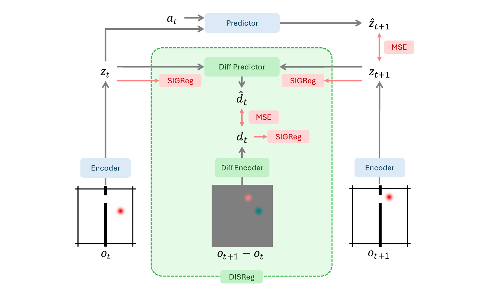

# MotionJEPA
### Preventing Temporal Feature Collapse by Capturing Visual Changes in Latent Space

Markus Karmann*, Shile Li*, Christian Internò, Bruno Andreis, David Klindt, Randall Balestriero, Jindong Gu, Philip Torr, Qi Zhang, Peng-Tao Jiang, Hao Zhang, Bo Li, Onay Urfalioglu

*Equal Contribution

**Abstract**: Joint Embedding Predictive Architectures (JEPAs) are a promising paradigm for learning task-agnostic latent world models without visual reconstruction. However, standard JEPA training exhibits a strong inductive bias towards slow features, causing feature suppression and the collapse of latent representation. While inverse dynamics provides temporal anti-collapse, it relies on action labels and offers little incentive to embed general, unlabeled dynamics. We introduce **D**ifference **I**mage and **S**ingle image embedding **Reg**ularization (DISReg), a novel regularizer that builds on an inverse-dynamics-style module that predicts temporal difference image embeddings without any pixel reconstruction loss, encouraging balanced static and dynamic feature learning. DISReg consists of a static term that shapes the distribution of the image embedding and encourages slow features, and a dynamic term, which, unlike direct regularization on the embedding, imposes no constraint on the image embedding's shape or distribution and instead only incentivizes that dynamic features be present. By integrating this regularizer into a standard JEPA, we establish our new architecture, MotionJEPA. Latent probing demonstrates that MotionJEPA produces more complete representations than other methods, and our trajectory analysis shows it maintains geometrically simple latent embeddings with low curvature. We further show that MotionJEPA improves downstream planning success under static-background distractors across four environments.

<p align="center">
  <a href="https://mkarmann.github.io/motion-jepa-project-page/"></a>
  <a href="https://arxiv.org/abs/2609.23881"></a>
  <a href="https://creativecommons.org/licenses/by/4.0/"></a>
</p>



## 📝 Overview

MotionJEPA is a latent JEPA world model that captures visual change in latent space to prevent temporal feature collapse.
This repository provides the code to reproduce results of the main offline probing tables and training on the three game environments. Downstream planning results are in the planning subrepo.

## 🔧 Installation

Requires **Python 3.11** and [uv](https://docs.astral.sh/uv/getting-started/installation/).

```bash
git clone --recurse-submodules https://github.com/mkarmann/motion-jepa.git
cd motion-jepa
uv sync
```

## 🚀 Usage

Example of running MotionJEPA on Pong:

```bash
bash run.sh pong motionjepa ./runs/pong_motionjepa
```

Train and evaluate one model on all three environments with three seeds:

```bash
bash run_all_environments_three_seeds.sh motionjepa
```

Or step by step:

```bash
uv run python train.py --model-type motionjepa --dataset-type pong --output-dir ./runs/pong_motionjepa
uv run python train_probes.py --run-dir ./runs/pong_motionjepa
uv run python evaluate.py --run-dir ./runs/pong_motionjepa
```

**Datasets:** `pong`, `dino`, `golf`

**Models:** `motionjepa`, `lewm`, `smwm`, `lewm-sigreg-time`, `lewm-tgt-detach`, `lewm-sigreg-flattened`

We also provide configurations for both default and hyperparameter-optimized versions in `configs/`:

```bash
uv run python train.py --config configs/pong_lewm_optimized.yaml --output-dir ./runs/pong_lewm_optimized
```

## ❤️ Acknowledgement

The core JEPA model architecture and SIGReg loss are taken from [LeWorldModel](https://github.com/lucas-maes/le-wm). We thank the authors for releasing their code.

## 📚 Citation

```bibtex
@misc{motionjepa2026,
      title={MotionJEPA: Preventing Temporal Feature Collapse by Capturing Visual Changes in Latent Space}, 
      author={Markus Karmann and Shile Li and Christian Internò and Bruno Andreis and David Klindt and Randall Balestriero and Jindong Gu and Philip Torr and Qi Zhang and Peng-Tao Jiang and Hao Zhang and Bo Li and Onay Urfalioglu},
      year={2026},
      eprint={2609.23881},
      archivePrefix={arXiv},
      primaryClass={cs.CV},
      url={https://arxiv.org/abs/2609.23881}, 
}
```

